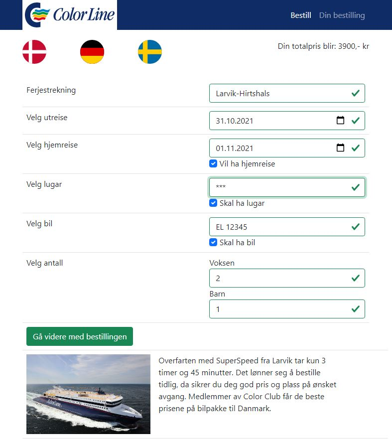
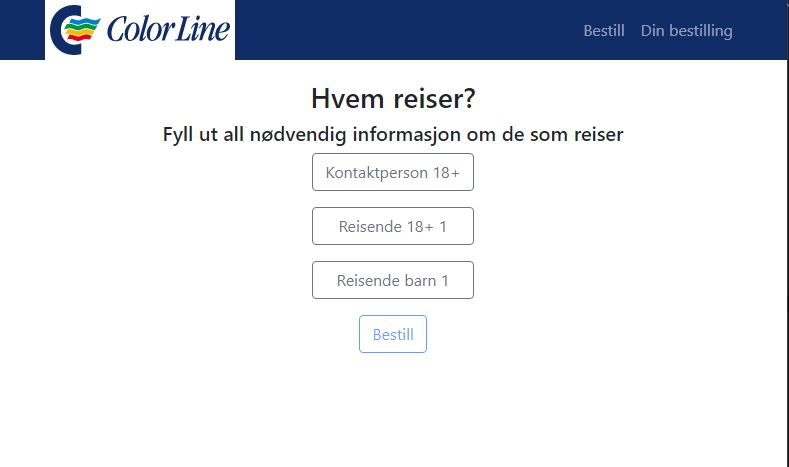
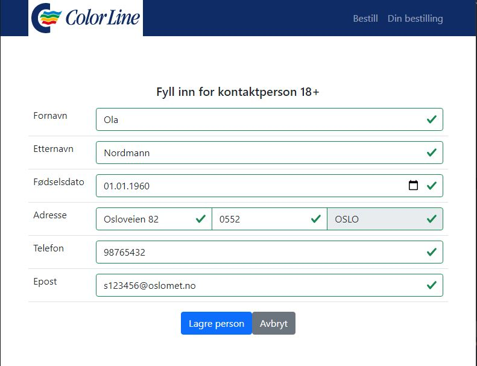
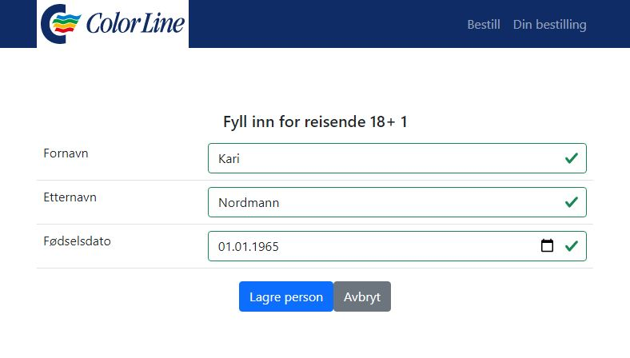
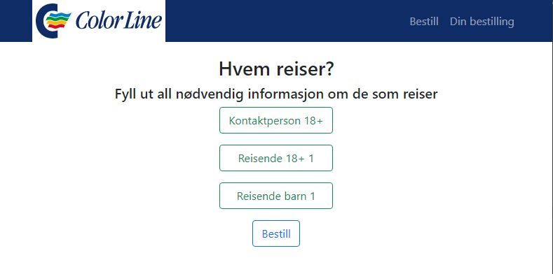
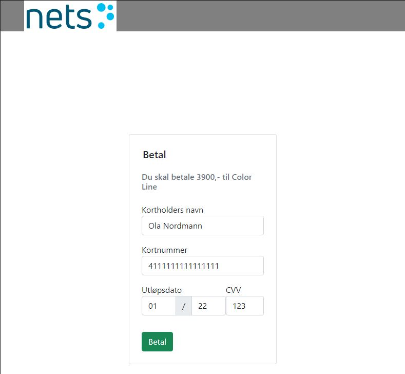
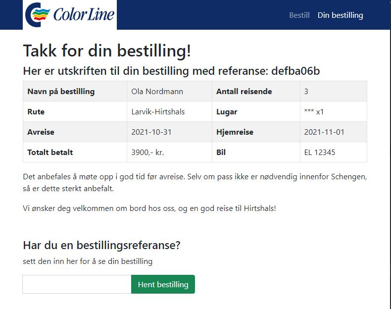
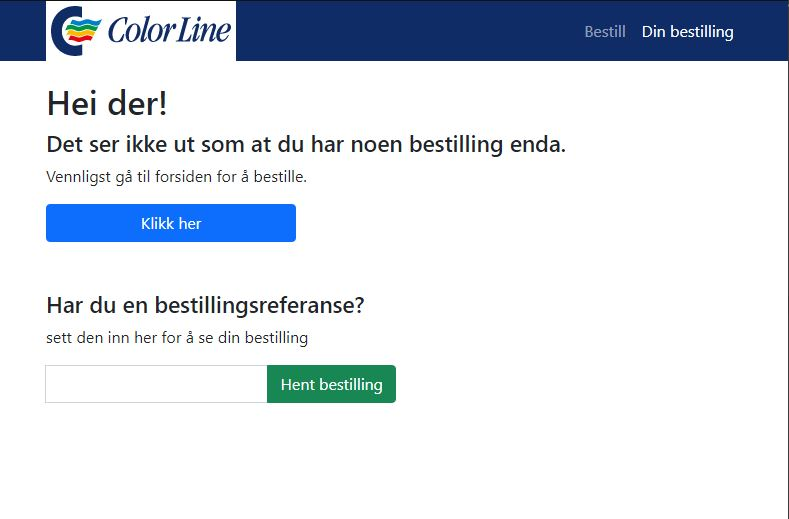

# Gruppeoppgave 1 - Bestille båttur
#### s341833, s341867 og s331394

## Introduksjon

Vi implementerte en løsning for å bestille billetter for color line. Vi har prøvd å holde det så
simpelt som mulig designmessig, men med all nødvendig funksjonalitet. Selv om det er simpelt design
er det fortsatt tilrettelagt for full responsivitet. Der vi har sett det passende har vi noen steder
lagt til eksta funksjonalitet for å vise både at vi kan og samtidig gi litt bedre "quality of life".
Det har vært mange ting vi har hatt lyst til å implementere opp gjennom utføringen, men som vi så
skulle være til oppgave 2, og har derfor ventet med dette.

## Implementasjon av backend

Vi har tatt i bruk Model View Controller (MVC). Vi har til tross ikke sett nødvendigheten av View i 
denne oppgaven. Databasestrukturen er utført med Entity Framework Code First hvor entitetene våre
er Bestilling, Reise, Lugar, Kunde og Post. Kundeentiteten har vi valgt å dele inn i 3 ulike tabeller
Kontaktperson, Voksen og Barn. Som alle arver fra kundeklassen. Dette fordi de har litt forskjellige
egenskaper og nødvendigheter. Post er tabell for å sjekke gyldighet og hente poststed til postnummer.
Vi har dekorert alle nødvendige attributter med required i tilfelle frontend valideringen ikke var
nok. Enkelte attributter er også dekorert med regex validering. Controllerene er dekorert med
ApiController. Denne tar seg av validering og sender automatisk feilmelding til klient.

Vi har flyttet all databasehåndtering ut til DAL-mappen. Her har vi interface-klasse struktur for
repositoryene slik at vi får injisert de i controller klassene. Vi har også en seeding fil som kalles
ved startup. Denne legger inn reisene og lugarene samt postnummer og poststed ved tom database.

Logging er også implementert. Her logges det til fil blant annet hver gang det legges til/hentes 
bestilling. Log filene legges til Logs mappen.

## Implementasjon av frontend

Det er implementert med vanilla JS, HTML og CSS hvor JQuery har blitt brukt som JavaScript bibliotek.
Bootstrap er blitt brukt som hjelp til styling, men vi har mange egne endringer i index.css også.

Vi har forsøkt å gjøre frontend valideringen så idiotsikker som mulig. For eksempel hvis du huker av
for at du vil ha lugar, så vil ikke knappen for å gå videre åpne seg før du faktisk har valgt en lugar.
Hvis du skulle vært snik nok til å gå inn i inspiser og manuelt lagt til en option for reisevalg
ville dette også ikke ha fungert. Det er lagt til regex på alle felter dette er naturlig. Det
inkluderer navn, adresse, postnummer, kortnummmer og regnummer på bil.

## Interaksjon med sluttproduktet

Bruker kommer til forsiden hvor h*n kan begynne sin bestilling. Her velges reise, utreise og antall
voksne/barn. Det er i tillegg valgfrie felter som hjemreise, bil og lugar. Lugar er obligatorisk om
Oslo-Kiel ruten er valgt. Prisen oppdateres kontinuerlig ved endring i inputfeltene. Når en gyldig
reise er utfylt åpnes knappen for å kunne gå videre med bestillingen.

Ved valg av å gå videre med bestillingen blir du tatt til en liste med personer som må bli fylt ut.
Det er alltid en Kontaktperson og resten er bokser med antall ekstra voksne og barn til bestillingen.
I motsetning til voksne og barn der kun navn og fødselsdato er nødvendig så må kontaktperson også
oppgi tlf-nummer, epost og adressse. Når en person er ferdig utfylt blir "boksen" til personen grønn.
Der alle personene har blitt grønne vil bestill knappen åpnes og man kan gå videre til betaling.

Betaling er enkelt laget og fungerer kun som en simulasjon. Det eneste som man må passe på er at
kortnummeret må passe en streng regex som godtar kun de største kortutgiverne. Ved feil i inputs, så
får man beskjed om det ved forsøk på å utføre betalingen.

Ved godkjent betaling vil man komme til en bekreftelsesside. Her får du referansenummer og en
tabellutskrift som forteller all informasjon om din ordre. Du har også muligheten til å hente en
annen bestilling for visning om man har en annen referansekode tilgjengelig. Denne siden er også
aksesserbar oppe i navigasjonsbaren fra forsiden. Hvis man kommer inn på siden trenger man ikke å lage
ny bestilling for å få utskrift, man kan bare fylle ut referansekoden her.

## Liste med mål og krav(som vi mener er implementert)

### Mål

- Lage en komplett løsning med mulighet for å foreta kjøp av billetter for oppgraderte sider for
båtturer. 
- Løsningen skal lages i .NET CORE (Vi gjorde dette i .NET 5 hvor CORE navnet sløyfes)
- Vise forståelse for NET Core, JavaScript/JQuery og Entity Framework.

### Funksjonalitet

- Forside med valg av strekning og tidspunkt
- Ikke nødvendig å registrere seg som kunde
- Ikke backend funksjonalitet for vedlikehold

- Design / Layout
- Funksjonalitet
- Ryddig og forståelig kode (JavaScript og C#)
- Database-struktur bruk av Entity Framework code first
- Validering
- Implementasjon i ASP.Core med Web-Klient basert på JavaScript (JQuery) (ikke krav om avansert
single page application)
- Brukervennlighet

## Skjermbilder

Alle skjermbilder er vist ferdig utfylt.

### Forside

### Reisende

### Betal

### Bekreftelse

Denne er for om du ikke har gått igjennom en bestilling før du går til bekreftelse.html

## Kommentarer om valg vi har tatt

- Designmessig har vi valgt å sette fokus responsivitet og UX, samt at det er enkelt.
- En ekstra funksjonalitet vi har lagt til er referansekode. Kunden får en unik streng på 8 tegn
der kan brukes til å hente opp igjen en bestillingsutskrift fra tidligere. Dette er spesielt nyttig
siden utskriften lagres kun i sessionstorage selv om selve bestillingen er å finne i databasen.
- Flaggene på forsiden er for å gi litt mer farge, men de kan også (om skjermstørrelsen er stor nok)
brukes til å velge reisestrekningen din. Da vil det automatisk komme opp i select feltet.

## Kilder

- Color line
- bootstrap